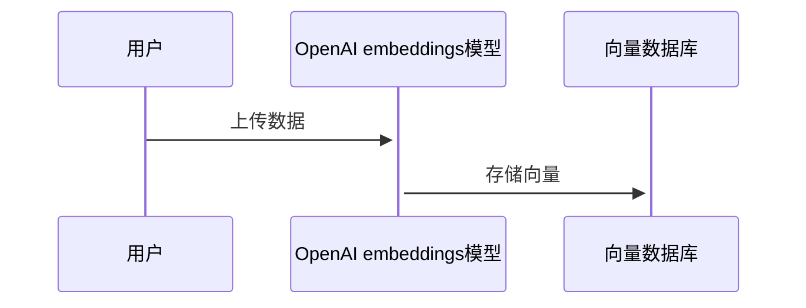
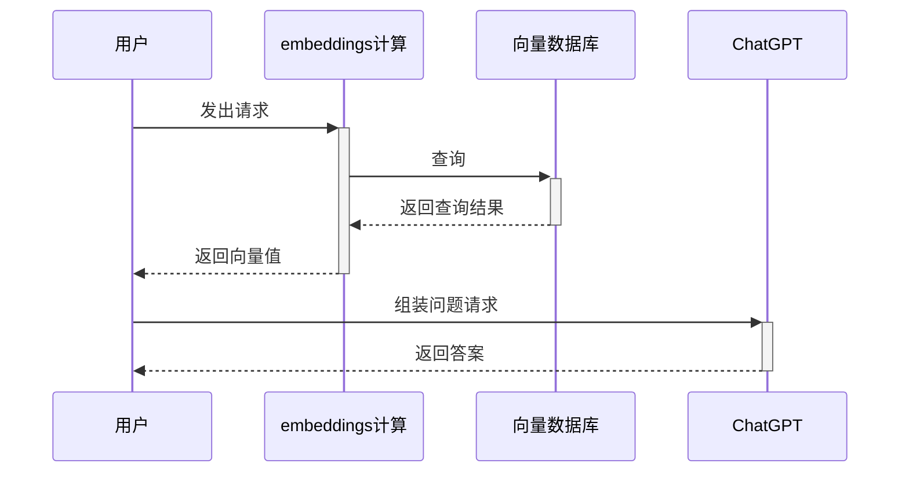

# document-ai
go基于向量数据库与GPT3.5的通用本地知识库方案(A universal local knowledge base solution based on vector database and GPT3.5)

## 流程

- 将本地答案数据集，转为向量存储到向量数据
- 当用户输入查询的问题时，把问题转为向量然后从向量数据库中查询相近的答案topK 这个时候其实就是我们最普遍的问答查询方案，在没有GPT的时候就直接返回相关的答案整个流程就结束了
- 现在有GPT了可以优化回答内容的整体结构，在单纯的搜索场景下其实这个优化没什么意义。但如果在客服等的聊天场景下，引用相关领域内容回复时，这样就会显得不那么的突兀。

### 文件上传流程



### 用户提问流程




## 启动

### Docker

#### config

> ./config/config.yaml

```yaml
server:
  port: 9999
openai:
  key: xx
qdrant:
  host: http://127.0.0.1:6333
  collection-name: test
```


```bash
docker-compose up -d
```


## 使用

### 上传测试数据

```bash
curl --location --request POST 'http://127.0.0.1:9999/data/json' \
--header 'Content-Type: application/json' \
--data-raw '[
  {
    "title": "普通感冒",
    "text": "您会出现喉咙发痒或喉咙痛，流鼻涕，流清澈的稀鼻涕（液体），有时轻度发热"
  },
  {
    "title": "常年过敏",
    "text": "症状包括鼻塞或流鼻涕，鼻、口或喉咙发痒，眼睛流泪、发红、发痒、肿胀，打喷嚏。"
  }
]'
```

### 提问

http://127.0.0.1:9999/

## 其他

参考：https://github.com/GanymedeNil/document.ai
